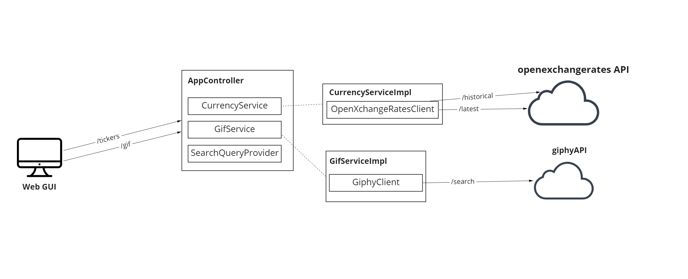

## Задание:

---
```
Создать сервис, который обращается к сервису курсов валют, и отдает gif в ответ:  

если курс по отношению к рублю за сегодня стал выше вчерашнего,  
то отдаем рандомную отсюда https://giphy.com/search/rich  
если ниже - отсюда https://giphy.com/search/broke  
Ссылки  
REST API курсов валют - https://docs.openexchangerates.org/  
REST API гифок - https://developers.giphy.com/docs/api#quick-start-guide  
Must Have  
Сервис на Spring Boot 2 + Java / Kotlin  
Запросы приходят на HTTP endpoint, туда передается код валюты  
Для взаимодействия с внешними сервисами используется Feign  
Все параметры (валюта по отношению к которой смотрится курс,   
адреса внешних сервисов и т.д.) вынесены в настройки  
На сервис написаны тесты   
(для мока внешних сервисов можно использовать @mockbean или WireMock)   
Для сборки должен использоваться Gradle  
Результатом выполнения должен быть репо на GitHub с инструкцией по запуску  
Nice to Have  
Сборка и запуск Docker контейнера с этим сервисом
```

##Решение (_сервис "Ruble4Gif"_):

---
Список валют (тикеров):
```
GET /r2g/tickers
```
Поучить гифку для выбранного тикера (пример):
```
GET /r2g/gif?ticker=USD&offset=1
```
## Как протестить / запуск

 - Использовать JAR в проекте либо собрать заново: ``./gradlew clean build`` (JAR будет в `/build/libs`)
 - Выполнить:

````
java -jar .\Ruble2Gif-1.0.jar
````

На http://localhost:8080/ будет поднят web GUI который предоставляет интеракцию с сервисом: 

